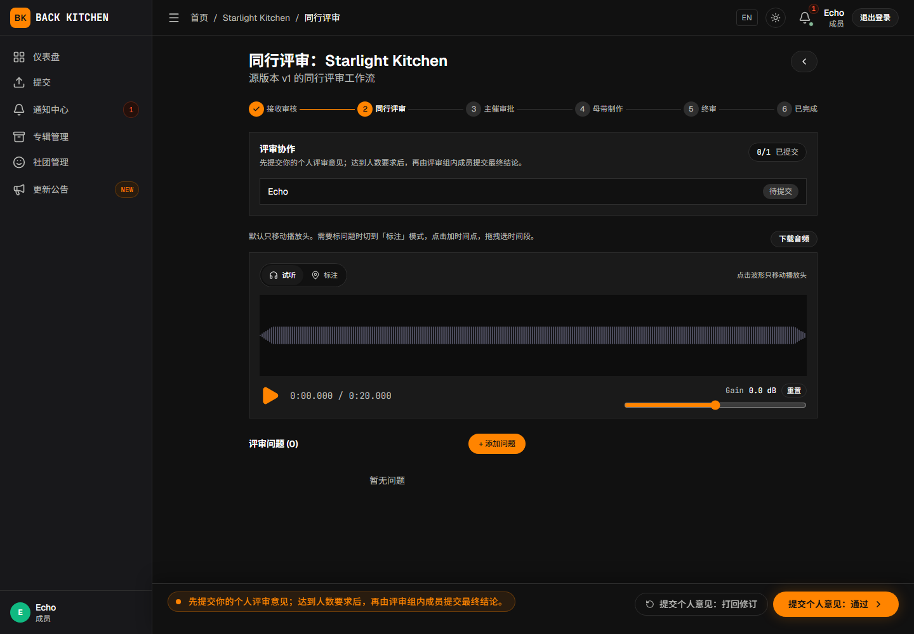
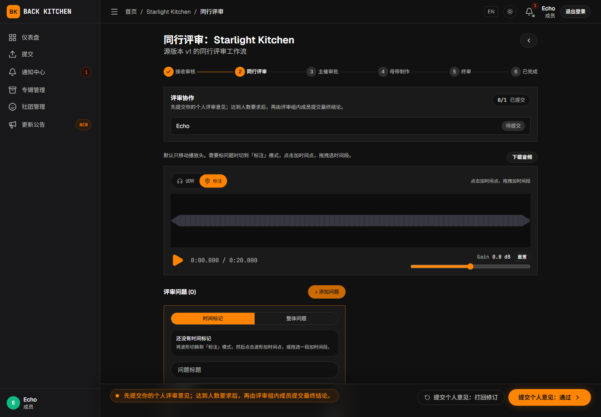

# 进行同行评审

适用对象：被分配同行评审任务的曲师或其他社团成员  
适用阶段：同行评审

只有收到当前曲目评审分配的用户，才能执行同行评审操作。曲师可以评审同一专辑中的其他曲目，但不会被分配自己的曲目。

## 操作前确认

- 通知或仪表盘中已经显示该评审任务。
- 曲目当前阶段为“同行评审”。
- 当前用户出现在评审分配中。
- 音频可以正常播放。
- 已经了解专辑同行评审清单和评审截止日期。

## 打开评审任务

1. 从仪表盘或通知中心打开被分配的曲目。
2. 确认当前工作流阶段为“同行评审”。
3. 查看评审任务状态和所需审阅人数。
4. 阅读曲目提交说明。
5. 完整审听当前源文件。

同行评审阶段可能隐藏曲师和其他评审人的真实身份。匿名编号不影响创建问题或提交评审结论。

## 使用波形进行审听

在波形播放器中可以：

- 播放或暂停；
- 跳转到指定时间；
- 查看已有问题标记；
- 选择时间点或时间范围；
- 打开对应问题详情；
- 在允许时比较不同源文件版本。

建议先完整审听一次，再进行细节检查。创建问题前，应确认当前播放的是最新源文件版本。

## 创建问题

### 时间点问题

适用于爆音、错音、瞬时杂音或某个具体事件。

1. 将播放位置移动到问题发生处。
2. 选择时间点标记。
3. 填写标题、描述和严重程度。
4. 根据需要添加附件。
5. 发布问题。

### 时间范围问题

适用于一段持续存在的音量、节奏、音色或编排问题。

1. 在波形上选择开始和结束时间。
2. 创建时间范围问题。
3. 描述该范围内的问题和期望结果。
4. 发布问题。

### 整体问题

适用于响度、整体平衡、结构或全曲通用事项。创建时不需要选择时间位置。

## 公开问题与内部讨论

多人同行评审时，页面提供“公开”和“仅内部”的切换。需要投稿曲师处理的问题应设为“公开”；尚未确定是否需要曲师修改，或只需要评审侧确认的问题，可以暂时设为“仅内部”。

投稿曲师看不到处于“待讨论”或“内部结案”状态的问题及其内部评论。决定要求曲师处理后，应将问题公开为“待处理”。“仅内部”主要保证对投稿曲师隐藏，不应理解为严格限制为指定评审人可见。

“仅内部”只在多人同行评审中提供。单人评审、主催审批和终审只支持公开问题。

## 填写同行评审清单

专辑启用同行评审清单时：

1. 找到评审页面中的“同行评审清单”。
2. 逐项检查并填写结果。
3. 点击“保存清单”。
4. 确认保存成功后再提交个人评审意见。

未保存当前评审人的清单时，平台不允许提交个人评审意见。清单只记录统一检查项，具体问题仍应单独创建。

## 提交评审意见

完成审听、问题记录和同行评审清单后，根据检查结果选择：

### 提交个人意见：打回修订

当前版本存在需要曲师修改的问题时，点击“提交个人意见：打回修订”。提交前应确认需要处理的问题已经公开，并能够让曲师理解修改要求。

### 提交个人意见：通过

当前版本可以继续，或所有意见都不需要阻止流程时，点击“提交个人意见：通过”。

## 多人评审

多人评审时，流程取决于专辑的“返修触发方式”。

### 达到人数后统一决定

1. 每位评审人先提交个人评审意见。
2. 达到“所需审阅人数”后，评审组进入最终决定状态。
3. 由评审组内成员点击“提交评审组最终结论：通过”或“提交评审组最终结论：打回修订”。
4. 曲目根据最终结论进入曲师修订或主催审批。

### 任一评审打回即返修

评审人可以先提交个人建议；问题已经明确时，也可以点击“要求曲师重新上传”，使曲目立即进入修订阶段。执行前应确保修改要求已经记录清楚。

固定评审模式下，实际分配到的固定评审人需要全部完成评审。

## 评审完成后

提交成功后：

- 当前评审任务被标记为完成；
- 多人评审可能继续等待其他评审人；
- 达到流程要求后，曲目进入修订或主催审批；
- 后续阶段仍可查看本次问题和评审记录。

不要通过重复提交尝试加快流程。曲目等待其他评审人时，应以页面提示为准。

## 常见问题

### 收到通知，但页面没有评审操作

任务可能已经被重新分配，或当前阶段已经结束。刷新页面后仍无操作时，请联系主催确认分配状态。

### 无法提交评审结论

请检查：

- 同行评审清单是否已经保存；
- 必填项目是否完成；
- 当前用户是否仍是有效评审人；
- 曲目是否仍处于同行评审；
- 是否正在等待达到多人评审的最终决定条件。

### 无法评审某首曲目

如果当前用户是该曲目的平台曲师，系统会将其排除，不能参与自己的曲目评审。

### 创建的问题没有显示给曲师

问题可能处于内部状态。需要曲师处理时，请将问题公开。

## 相关说明

- [问题、评论、附件与版本](../issues-and-versions.md)
- [主催：设置同行评审规则](../producer/workflow.md)
- [曲师：处理反馈、上传修订与确认母带](revision.md)
