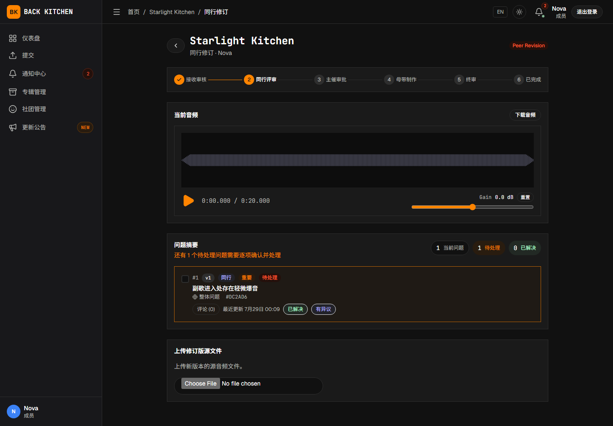

# 处理反馈、上传修订与确认母带

适用对象：投稿曲师；实际代外部曲师投稿的主催或副主催

投稿后，曲师可能需要在同行修订、主催修订、母带修订和终审阶段继续操作。每次上传新源文件都会建立新的版本记录，不会覆盖旧版本。

## 查看需要处理的反馈

1. 从通知或仪表盘打开需要修订的曲目。
2. 确认当前工作流阶段。
3. 查看公开问题和评论。
4. 使用严重程度和状态筛选需要优先处理的问题。
5. 注意每个问题对应的源文件版本和时间位置。
6. 在开始修改前确认所有要求已经理解。

同行评审内部问题不会显示给投稿曲师。曲师只需处理当前可见的公开问题。

## 更新问题状态

### 标记为已解决

已经按要求完成修改，或确认问题已经处理时，可将问题标记为“已解决”。建议同时填写处理说明，说明修改了什么。

### 标记为有异议

认为问题不需要修改、无法按建议修改或存在其他判断时，可选择“有异议”。应说明：

- 不同意的具体原因；
- 当前处理方式；
- 可能产生的影响；
- 是否需要主催或评审人进一步确认。

“有异议”不是删除问题。评审人或负责人可以继续讨论或重新打开问题。

### 批量处理问题

多个问题采用相同处理结果时，可以使用批量操作。提交前应检查所选问题，避免将尚未处理的事项误标为已解决。

## 上传同行修订版

曲目处于同行修订阶段时：

1. 完成源音频修改。
2. 在问题列表中更新相关问题状态。
3. 选择新的修订音频。
4. 根据需要填写“修订说明”。
5. 根据页面选项关联本次处理的问题。
6. 点击“上传修订版”。
7. 等待上传完成。

上传成功后：

- 曲目版本号增加；
- 新文件成为当前源版本；
- 旧源文件继续保留；
- 默认工作流下，曲目返回同行评审；自定义工作流按配置的返回目标和页面继续；
- 评审人收到新的处理任务。

## 处理主催要求的再次修订

主催在“主催审批”中要求再次修改时，曲目进入主催修订阶段。

操作方法与同行修订相同：

1. 阅读主催问题和说明。
2. 更新相关问题状态。
3. 上传新的源文件版本。
4. 根据需要填写修订说明。
5. 默认工作流下提交后等待曲目返回“主催审批”；自定义工作流按配置的返回目标和页面继续。

修订说明为可选项；如填写，应明确回应主催提出的内容，方便其判断是否可以送母带。

## 处理母带阶段修订

母带工程师提出修订时，会先指定需要提交的内容：

- 修改并上传新的源音频；或
- 提交外部分轨链接，即通过团队使用的外部存储服务共享分轨文件。

曲师页面会直接显示母带工程师指定的表单，正常情况下无需自行选择提交方式。如果页面显示的要求与实际需要不一致，请先通过母带沟通联系母带工程师，由其重新确认修订要求。

### 上传新的源音频

1. 确认页面要求提交源音频。
2. 选择新文件。
3. 根据需要填写修订说明。
4. 更新相关问题状态。
5. 点击“上传修订版”。

### 提交外部分轨链接

1. 确认页面显示“提交分轨 / 多轨网盘链接”。
2. 在“网盘链接、提取码和说明”中填写共享链接、提取码及必要的文件和版本说明。
3. 自行确认链接权限允许母带工程师访问，并检查有效期。
4. 点击“提交分轨链接”。

平台会要求去除首尾空白后的填写内容非空且不超过 5000 个字符，但不会自动验证 URL 格式、访问权限或有效期。需要补充多个文件时，应整理到同一个可访问的共享位置。

修订完成后，默认工作流会返回“母带制作”，由母带工程师继续处理；自定义工作流按配置的返回目标和页面继续。

## 查看和比较历史版本

打开版本选择器，可以查看不同源版本的记录。在历史音频文件仍处于保留期内时，可以：

- 播放或下载有音频文件的旧版本；
- 查看版本号、上传者和修订说明；
- 查看绑定到该版本的问题；
- 比较有音频文件的修订前后音频。

曲目完成后，平台当前默认只继续保留非当前源版本的音频文件 7 天。需要长期归档时，请及时下载。文件到期后，版本记录和关联问题仍可能保留，但旧音频不能继续播放或下载。

旧版本处于只读模式，不能用于创建针对当前制作的新问题。

## 在终审中确认母带

母带交付进入终审后：

1. 打开当前母带交付物。
2. 完整播放或下载文件。
3. 查看交付说明和历史版本。
4. 检查是否仍有需要处理的问题。
5. 确认无误后点击“批准当前母带”。

只有主催和投稿侧都批准后，曲目才会进入“已完成”。多人合作曲目只需要其中一位绑定的平台曲师完成投稿侧批准，不要求每位曲师分别操作；确认前应先在团队内统一意见。主催已经批准并不表示投稿侧可以省略确认。

## 退回有问题的母带

当前终审界面可能同时显示“打回到「母带制作」”和“请求退回”。发现问题时，应先创建终审问题或发表评论，写明具体原因、时间位置和期望结果。

- 页面允许直接退回时，可以点击“打回到「母带制作」”；这是直接退回操作。
- “请求退回”只会发送退回请求并通知有权限的负责人，但不会自行改变曲目阶段。提交后需等待负责人处理。
- 无法直接退回时，请联系主催或等待请求处理。

不要在存在明确问题时先批准再退回。批准操作表示认可当前母带作为最终版本。

## 拒绝后重新提交

曲目处于允许重新提交的拒绝状态时：

1. 打开被拒绝的曲目。
2. 阅读拒绝原因。
3. 准备新的源音频。
4. 点击“上传新源音频”。
5. 选择文件并等待上传完成。

重新提交会开启新的制作周期，并返回工作流第一阶段。旧周期记录不会被删除。

最终拒绝的曲目不会显示普通重新提交操作。

## 已完成后申请重新开启

已完成曲目需要再次进入正式制作流程时，投稿曲师可以：

1. 选择申请重新开启；
2. 选择希望返回的工作流阶段；
3. 填写重新开启原因；
4. 提交申请。

申请获批时会使用曲师提交时选择的目标阶段。返回首个交付阶段或更早阶段时，平台会建立新的制作周期；返回晚于首个交付阶段的阶段时，不会增加周期。重新开启会清除当前母带的双方批准状态，需要重新终审。

提交申请后，主催会收到通知；重新开启申请由平台管理员审批。提交前应先与主催确认重新开启安排，提交后请联系平台管理员处理。申请停留在待处理状态期间，不能再次申请重新开启或提交源音频补交。

不要让主催另行使用“直接重新开启”替代申请审批。直接重新开启不会将原申请标记为已处理，可能留下仍处于待处理状态的申请。

## 提交源音频补交申请

专辑启用源音频补交后，页面会在符合条件的非修订阶段提供补交入口，不限于已完成曲目。

提交前应确认这不是当前修订阶段可以正常处理的文件更新。申请提交后：

- 曲目立即进入源音频补交待处理状态，普通工作流操作暂时停止；
- 当前审批卡不能让审批人直接试听或下载暂存文件，应通过团队认可的安全方式另行提供可核对的文件；
- 批准目标不能是修订阶段，也不能晚于首个交付阶段；
- 批准会建立新的制作周期，使新文件成为当前源版本，并使旧的当前母带失效；
- 拒绝后，曲目恢复申请前的阶段；
- 投稿侧可以在审批前点击取消，取消后暂存文件会被删除，曲目恢复申请前的阶段。

源音频补交会使已经完成的评审或母带工作需要重新进行。申请说明中应写明补交原因、文件版本和影响范围，并在提交后与主催确认核对方式。

## 常见问题

### 上传新版本后旧文件还在

这是正常行为。平台保留不可变的历史版本，用于比较和追踪制作过程。

### 问题标记为已解决后又被重新打开

评审人或负责人检查新版本后仍认为问题存在，可以重新打开。请查看新增评论并继续处理。

### 外部分轨链接无法提交或无法访问

请确认页面要求的是外部分轨链接，并自行检查共享链接、提取码、分享权限和有效期。平台会要求去除首尾空白后的填写内容非空且不超过 5000 个字符，但不会自动验证 URL 格式、实际可访问性、访问权限或有效期，建议使用不需要额外申请权限的团队共享链接。

### 主催已经批准，但曲目仍处于终审

投稿侧还需要点击“批准当前母带”。双方都批准后曲目才会完成。

## 相关说明

- [提交自己的曲目](submission.md)
- [进行同行评审](peer-review.md)
- [问题、评论、附件与版本](../issues-and-versions.md)
- [母带沟通、交付、修改与确认](../mastering.md)
