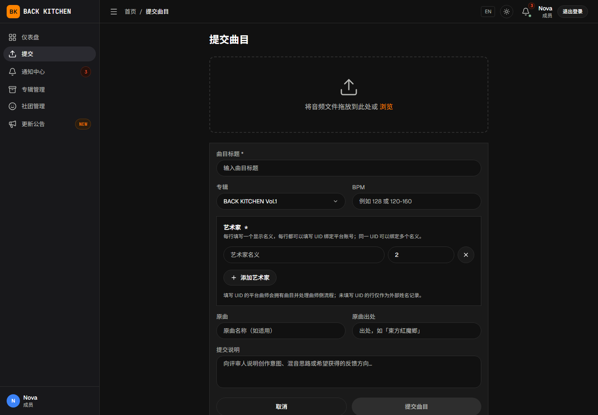
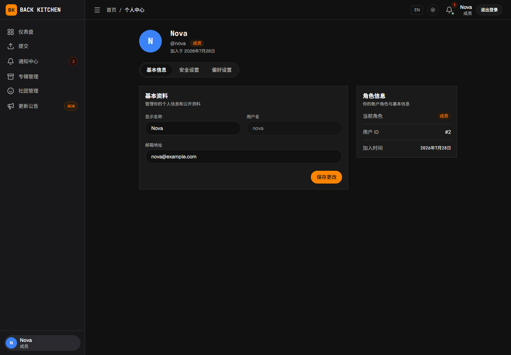

# 提交自己的曲目

适用对象：投稿曲师；代外部曲师投稿的主催或副主催

提交曲目时，需要选择专辑、上传源音频，并在艺术家信息中绑定实际参与创作的平台用户。

## 操作前确认

- 已经按照[注册、邮箱验证与登录](../getting-started.md)中的步骤，通过邀请码加入专辑所属社团。
- 能够在平台中看到目标专辑。
- 已经准备正确的源音频文件。
- 已经取得所有平台曲师的用户 UID。
- 已经准备曲目标题、艺术家名义和必要的补充资料。

## 查找用户 UID

平台曲师需要通过用户 UID 与曲目绑定。“个人中心”页面显示的“用户 ID”就是投稿表单所称的 UID。点击页面左下角的头像可以进入“个人中心”。

多人合作曲目应提前收集所有平台曲师的 UID。不要使用用户名、邮箱或社团昵称代替 UID。

## 打开投稿页面

1. 登录平台。
2. 打开侧栏中的“提交”。
3. 选择目标专辑。
4. 选择需要上传的音频文件。

如果目标专辑没有显示，请确认自己已经加入所属社团，并具有该专辑的访问权限。

## 填写曲目信息

投稿表单包括：

- 曲目标题；
- 艺术家名义；
- 平台用户 UID；
- BPM；
- 原曲；
- 出处；
- 提交说明；
- 音频文件。

提交时必须选择目标专辑和音频文件，填写曲目标题，并至少保留一行具有艺术家名义的艺术家信息。曲目还必须绑定至少一名平台曲师，或由主催、副主催为纯外部曲师代投。BPM、原曲、出处和提交说明可以根据专辑要求填写。

## 添加平台曲师

每一行艺术家信息可以填写显示在曲目上的艺术家名义，并使用平台用户 UID 绑定实际曲师。

1. 填写艺术家名义。
2. 输入对应平台用户 UID。
3. 多人合作时继续添加艺术家行。
4. 检查每个艺术家与 UID 是否对应。

被绑定的用户必须属于专辑关联社团。提交成功后，这些用户将获得该曲目的投稿侧权限。

## 添加外部曲师

没有平台账户的参与者可以只填写外部曲师姓名，不填写平台用户 UID。

需要注意：

- 曲目至少需要一名平台曲师或外部曲师；
- 普通成员不能提交完全由外部曲师组成的曲目；
- 纯外部曲师的曲目必须由专辑主催或副主催代为投稿；
- 实际代投稿人将负责后续投稿侧修订和最终确认。

平台不会向外部曲师发送任务或通知。

## 上传并提交

1. 再次检查目标专辑。
2. 确认音频文件选择正确。
3. 检查曲目标题和艺术家信息。
4. 根据需要填写 BPM、原曲、出处和提交说明。
5. 点击“提交曲目”。
6. 等待上传和提交完成，不要重复点击按钮或关闭页面。

前端会拒绝超过 200 MB 的源音频文件。文件较大时，请在上传前确认网络稳定。

## 提交完成后

投稿成功后：

- 平台创建源文件版本 1；
- 曲目进入默认工作流的“接收审核”；
- 主催收到新投稿通知；
- 平台曲师可以查看该曲目的进度；
- 后续修订不会覆盖初始版本。

投稿曲师暂时不需要继续推进流程，应等待主催接收或退回。

## 提交说明建议

提交说明可以包括：

- 当前版本的完成程度；
- 希望评审重点检查的部分；
- 已知但暂未处理的问题；
- 特殊编曲、混音或音色说明；
- 与外部分轨或母带制作有关的注意事项。

说明应简洁具体，不要只填写“请检查”等缺少信息的内容。

## 常见问题

### 提示 UID 无效

请确认输入的是正整数 UID，并检查该用户已经加入专辑所属社团。

### 无法选择目标专辑

当前用户可能尚未加入所属社团或专辑团队。请联系主催确认成员配置。

### 普通成员无法提交纯外部曲师曲目

这是平台权限限制。请由专辑主催或副主催代为投稿，并填写外部曲师姓名。

### 上传过程中失败

请检查文件大小、网络连接和登录状态。不要反复提交同一表单；先确认曲目列表中是否已经产生记录，再重新尝试。

### 提交后发现文件错误

在主催尚未处理前，应立即联系主催。主催可以选择“拒绝（可重新提交）”，由曲师上传正确文件并重新进入流程。

## 相关说明

- [认识社团、专辑和曲目职责](../roles.md)
- [处理反馈、上传修订与确认母带](revision.md)
- [主催：接收投稿与分配评审](../producer/intake.md)
