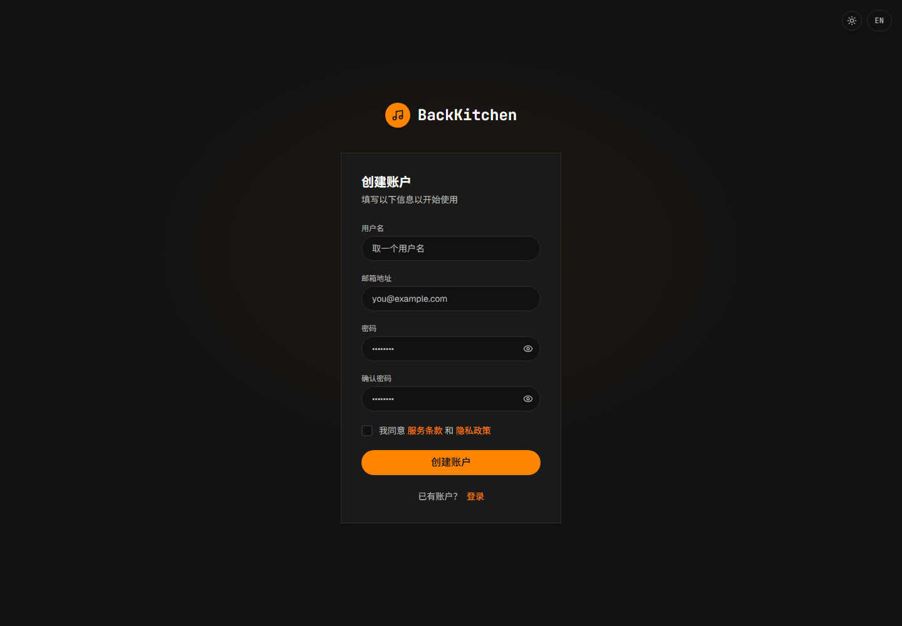
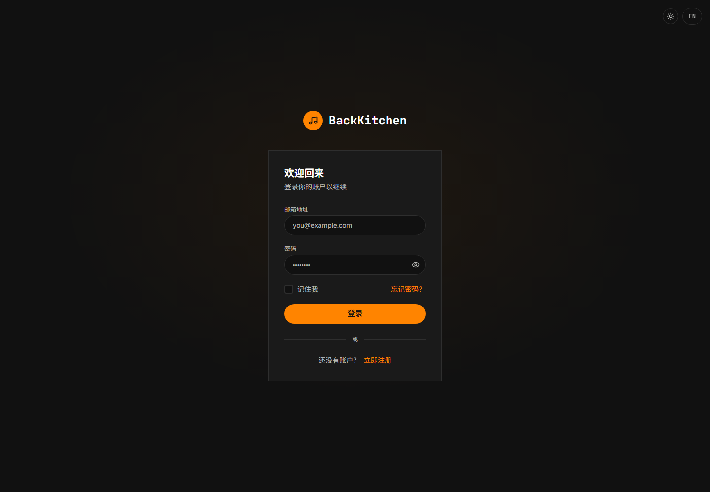

# 注册、邮箱验证与登录

适用对象：所有用户

所有公开注册的账户初始身份都是普通成员。需要创建社团和担任主催的用户，应在完成注册后联系平台管理员开通主催权限。

## 注册账户

1. 打开登录页面。
2. 选择“创建账户”。
3. 填写用户名、邮箱、密码和确认密码。
4. 勾选同意服务条款和隐私政策。
5. 点击“创建账户”。

用户名、邮箱、密码、确认密码和同意条款均为必填项。密码至少需要 8 个字符，用户名和邮箱不能与现有账户重复。

当前注册页的服务条款和隐私政策链接未提供可阅读的正文。需要查阅时，请先向平台管理员索取现行文本，再决定是否勾选同意。

## 验证邮箱

注册成功后，平台会向填写的邮箱发送验证邮件。

1. 打开验证邮件。
2. 点击邮件中的验证链接。
3. 返回平台登录页面。

未完成邮箱验证时，账户不能正常登录。如果没有收到邮件，请先检查垃圾邮件目录，并确认注册时填写的邮箱地址正确。

## 登录平台

1. 打开登录页面。
2. 输入注册邮箱和密码。
3. 点击“登录”。

登录成功后将进入仪表盘。仪表盘显示当前用户能够访问的专辑、曲目和待处理任务。

## 忘记密码

1. 在登录页面选择“忘记密码”。
2. 输入注册邮箱并提交。
3. 打开密码重置邮件。
4. 通过邮件中的链接设置新密码。
5. 使用新密码重新登录。

出于账户安全考虑，平台不会在页面中显示该邮箱是否已注册。没有收到邮件时，请检查邮箱地址和垃圾邮件目录。

## 通过邀请码加入社团

曲师、同行评审人和母带工程师通常需要先通过邀请码加入社团：

1. 向社团主催获取有效邀请码。
2. 登录平台。
3. 打开“社团管理”。
4. 点击“加入社团”。
5. 输入邀请码。
6. 点击“加入”。

加入成功后，用户会出现在社团成员列表中。加入社团不会自动分配专辑或曲目任务；还需要由主催配置专辑团队，或分配具体投稿、评审和母带职责。

邀请码可能具有普通成员或母带工程师等初始身份，并可能设置有效期。提示邀请码无效时，请联系社团主催获取新邀请码。

## 开通主催权限

公开注册页面不能选择主催身份。需要创建社团的用户应：

1. 完成普通账户注册和邮箱验证。
2. 将注册邮箱或用户 UID 提供给平台管理员。
3. 由平台管理员开通主催权限。
4. 退出并重新登录，然后检查是否可以看到“新建社团”入口。

开通主催权限不会自动使用户成为现有社团或专辑的管理者。现有社团仍需由社团主催添加或调整成员身份。

## 常见问题

### 提示邮箱或用户名已存在

请改用其他用户名，或使用已有账户登录。忘记已有账户密码时，应使用密码重置功能。

### 提示邮箱尚未验证

完成验证邮件中的操作后再登录。如果验证链接已经失效，请重新获取验证邮件或联系平台管理员。

### 登录后看不到任何专辑

注册账户不会自动加入社团或专辑。请通过邀请码加入社团，并等待主催将你加入制作团队或分配曲目任务。

### 已开通主催权限，但仍看不到主催功能

请退出后重新登录。如果仍未显示，请联系平台管理员确认账户角色是否已经更新。

## 相关说明

- [认识社团、专辑和曲目职责](roles.md)
- [主催：创建和管理社团](producer/circles.md)
- [通知、待办事项与曲目状态](notifications.md)
