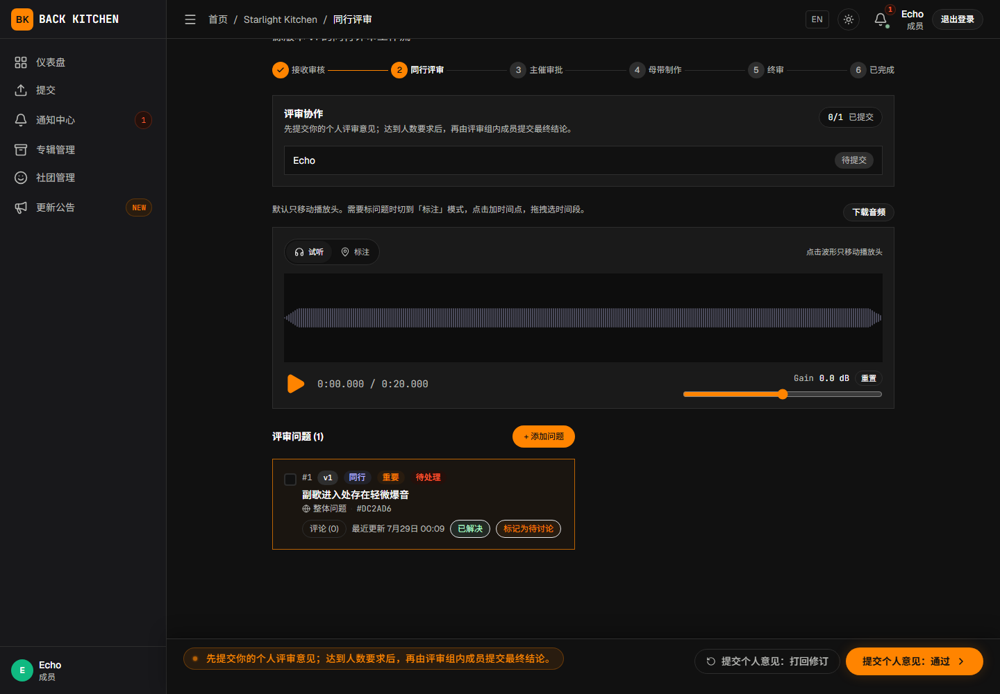
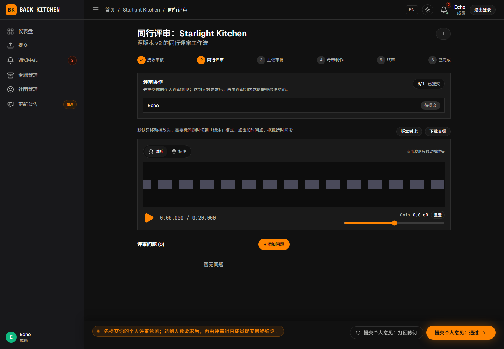

# 问题、评论、附件与版本

适用对象：主催、曲师、同行评审人、母带工程师

问题用于记录需要确认或修改的具体事项。问题可以绑定到某个时间点、某段时间范围或整首曲目，并保留其创建时对应的音频版本。

## 创建问题

在允许提出问题的审听页面中：

1. 播放当前音频。
2. 选择问题标注方式：时间点、时间范围或整体问题。
3. 在波形上选择位置或范围；整体问题不需要选择时间。
4. 填写问题标题和描述。
5. 选择严重程度。
6. 根据需要添加图片或音频附件。
7. 在多人同行评审中，根据需要选择“公开”或“仅内部”。“仅内部”会将问题置为“待讨论”，对投稿曲师隐藏。
8. 确认并发布问题。

问题的“公开 / 仅内部”与曲目页面的“所有成员可见 / 仅相关人员可见”是两项不同设置。后者控制整首曲目的访问范围。

只有多人同行评审中的“仅内部”能够形成评审侧内部问题。单人评审、主催审批和终审只支持公开问题，不会显示“仅内部”。即使在多人同行评审中，“仅内部”也主要保证问题对投稿曲师隐藏，不应理解为严格限制为指定评审人可见。

比较历史版本时，旧版本通常处于只读状态，不能在旧版本上创建新问题。

## 选择严重程度

| 严重程度 | 建议用途 |
|---|---|
| 严重 | 应优先处理的阻断性事项，需在推进流程前确认解决 |
| 重要 | 明显影响作品质量或交付要求的问题 |
| 轻微 | 不影响整体方向，但建议修正的细节 |
| 建议 | 可选的改善意见或主观建议 |

严重程度用于帮助参与者排序，不会自动决定曲目是否进入修订阶段。是否要求修订仍由当前阶段的评审结论或负责人操作决定。

## 问题状态

| 状态 | 含义 |
|---|---|
| 待处理 | 问题已经公开，等待曲师或负责人处理 |
| 待讨论 | 问题转入评审侧内部讨论，曲师不可见 |
| 内部结案 | 问题在内部处理完毕，不再要求曲师处理 |
| 有异议 | 曲师不同意该问题或认为无需修改 |
| 已解决 | 问题已经处理完成 |

问题状态只能按照当前状态和用户职责进行转换：

| 操作人 | 可以执行的主要操作 |
|---|---|
| 投稿侧 | 将非终审阶段的“待处理”问题标记为“已解决”或“有异议” |
| 当前阶段的处理人 | 将“待处理”问题设为“已解决”或“待讨论”；将“待讨论”设为“内部结案”；将“已解决”或“有异议”重新打开 |
| 问题创建者或当前阶段的处理人 | 将“待讨论”或“内部结案”公开为“待处理” |
| 专辑母带工程师 | 处理终审阶段的问题状态；投稿曲师不能直接修改终审问题状态 |

“有异议”不能由投稿侧直接改为“已解决”，需要先由当前阶段的处理人重新打开。按钮没有显示时，应先确认问题当前状态和自己的处理职责。

## 回复问题和发表评论

打开问题后，可在评论区：

- 输入文字说明；
- 引用音频时间；
- 引用其他问题；
- 提及相关用户；
- 添加图片或音频附件。

评论可以只有附件，不必同时填写文字。只有评论作者可以编辑或删除自己的普通评论。问题状态变更产生的状态说明不能编辑或删除。

平台会保留评论的编辑历史。需要核对修改前内容时，可以打开对应的编辑历史记录。

## 附件限制

创建问题时，当前界面允许：

- 最多添加 3 个音频附件；
- 单个音频文件不超过 200 MB；
- 使用 MP3、WAV、FLAC、AAC 或 OGG；
- 最多添加 3 张图片；
- 单张图片不超过 10 MB；
- 使用 JPEG、PNG、GIF 或 WebP；
- 直接粘贴剪贴板中的图片。

上传前请确认附件中不包含无关或不应向当前参与者公开的信息。

## 公开问题与内部讨论

多人同行评审中，“仅内部”用于评审侧讨论，并会将问题置为“待讨论”。需要投稿曲师处理的问题应设为“公开”；决定要求曲师处理后，应及时将问题公开为“待处理”。

“仅内部”主要表示对投稿曲师隐藏，不是严格限制为指定评审人可见。单人评审、主催审批和终审只支持公开问题。

## 查看源文件版本

“制作周期”用于区分一次完整制作与重新进入流程后的新一轮制作。初始投稿和拒绝后的重新提交会建立新的周期；重新开启时是否增加周期取决于选择返回的阶段。

每次初始投稿、上传修订版，或在母带修订中提交外部链接时，平台都会建立新的源文件版本记录。版本记录包含：

- 当前制作周期；
- 版本编号；
- 文件或外部链接；
- 修订说明；
- 上传者；
- 上传时间。

在曲目页面选择历史源版本后，只有该版本有实际保留的音频文件且文件仍处于保留期内，才可以播放、下载或与当前音频比较；外部链接版本只保留链接记录，不能按音频文件播放或比较。历史版本记录不会因上传新版本而被覆盖。

曲目完成后，平台当前默认只继续保留非当前源版本的音频文件 7 天。保留期结束后，版本编号、上传者、修订说明和关联问题仍可能显示，但旧音频文件不能继续播放或下载。需要长期归档时，请在曲目完成后及时下载所需文件。

问题会保留其创建时对应的源版本。查看旧问题时，应注意它可能针对较早的音频内容。

当前主波形只显示当前源文件上的问题标记；旧源版本的问题不会继续显示为当前波形标记，但仍保留在问题列表中，并带有对应版本标识。

## 查看母带交付版本

母带工程师每次上传交付物时，平台都会建立母带交付记录。上传者完成确认后，交付物才会按工作流继续进入终审。

在母带工作台中可以查看：

- 当前母带交付物；
- 历史交付版本；
- 交付说明；
- 上传和确认时间；
- 主催及投稿侧的批准状态。

重新开启时，返回首个交付阶段或更早阶段会增加制作周期；返回晚于首个交付阶段的阶段不会增加周期。旧交付物仍作为历史记录保留；当前母带的批准状态会被清除，需要重新终审。

## 归档与保留期

曲目或专辑归档后，会从活跃列表中隐藏，并可在 **14 天内**由有权限的主催恢复。超过 14 天后，归档对象及其曲目、问题、评论、源文件版本、母带交付物和附件会被永久删除，无法恢复。归档前应先下载需要长期保存的资料。

归档保留期与旧源音频保留期是两项不同规则：曲目即使没有归档，完成后非当前源版本的音频文件也默认只继续保留 7 天；归档则会在 14 天后删除整个曲目或专辑及其关联内容。

## 常见问题

### 无法在当前音频上创建问题

请确认当前页面允许提出问题，并检查是否正在查看历史版本。历史版本比较模式通常只允许查看现有问题。

### 曲师看不到评审人提到的问题

该问题可能仍处于“待讨论”或“内部结案”状态。需要曲师处理时，评审人应将问题公开。

### 上传修订版后，旧问题没有消失

问题和历史版本会保留用于追踪制作过程。请根据新版本内容更新问题状态，而不是删除旧记录。

## 相关说明

- [曲师：进行同行评审](composer/peer-review.md)
- [曲师：处理反馈、上传修订与确认母带](composer/revision.md)
- [母带沟通、交付、修改与确认](mastering.md)
