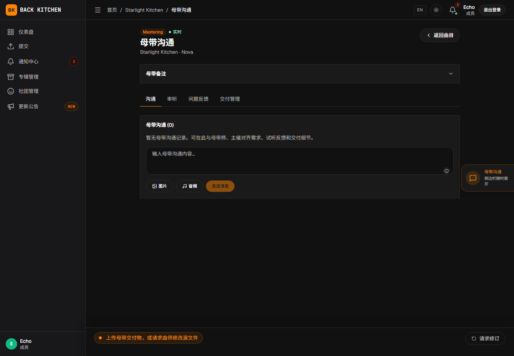
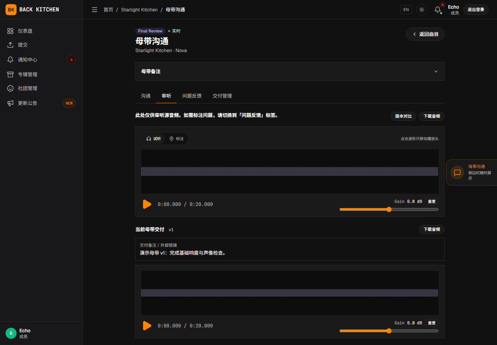
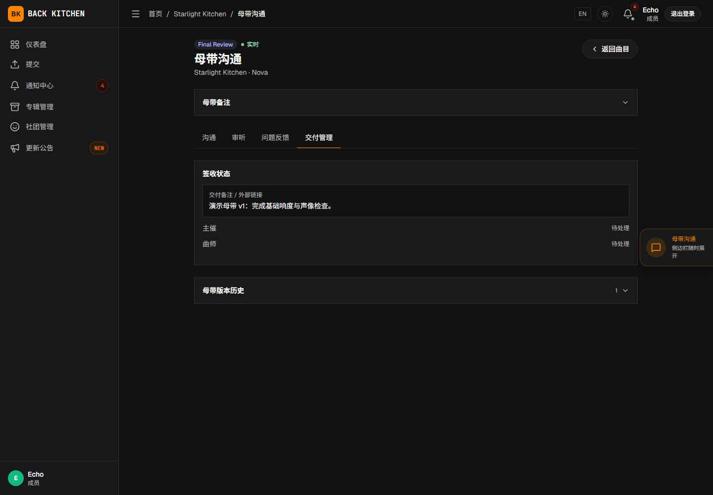

# 母带沟通、交付、修改与确认

适用对象：被指定为当前专辑母带工程师的用户  
适用阶段：母带制作

社团中的“母带工程师”身份不会自动分配具体任务。只有在专辑设置中被指定为该专辑的母带工程师后，用户才能执行母带操作。

## 操作前确认

- 已经按照[注册、邮箱验证与登录](getting-started.md)中的步骤加入专辑所属社团，并被指定为该专辑的母带工程师。
- 曲目当前处于“母带制作”。
- 可以正常播放或下载当前源文件。
- 已经阅读主催、曲师和同行评审留下的问题与说明。
- 已经确认交付格式、命名和截止日期。

## 打开母带任务

从仪表盘、通知或曲目详情打开母带任务，页面可能进入“母带制作”阶段页，或进入标题为“母带沟通”的母带工作台。两种入口都围绕以下功能组织，具体布局可能不同：

- **沟通**：与曲师和主催讨论制作事项；
- **审听**：播放和检查当前源文件或母带；
- **问题反馈**：创建和处理母带阶段问题；
- **交付管理**：上传、确认和查看母带交付记录。

## 下载和检查源文件

1. 打开“审听”。
2. 确认当前源文件版本号和上传时间。
3. 完整播放或下载文件。
4. 查看修订说明和历史版本。
5. 检查是否有尚未处理的公开问题。

母带制作应基于当前源版本。发现平台中的当前版本与团队约定不一致时，应先确认，不要直接上传交付物。

## 使用母带沟通

“沟通”用于记录与当前曲目母带制作有关的信息。可以发送：

- 文字消息；
- 图片；
- 音频附件；
- 时间引用；
- 问题引用；
- 用户提及。

母带沟通只向该曲目的曲师、专辑主催和专辑母带工程师开放。重要决定应记录在平台中，避免只保留在外部聊天工具里。

只有消息作者可以编辑自己的消息，平台会保留编辑历史。

## 创建母带问题

在“问题反馈”或审听区域中，可以创建时间点、时间范围或整体问题。发现源文件不适合继续制作时，应：

1. 标记具体时间位置或范围。
2. 填写问题标题和说明。
3. 选择严重程度。
4. 根据需要添加音频或图片附件。
5. 发布问题。

问题应明确说明需要修改源文件，还是只需要提供额外分轨或说明。

## 请求修订

当前源文件需要曲师处理时：

1. 创建问题或发表评论，记录具体修订要求。
2. 点击“请求修订”。
3. 选择需要曲师提交新源音频还是外部分轨链接。
4. 确认曲目进入母带修订阶段。

“请求修订”没有单独填写原因的表单。必须在点击前通过问题或评论说明修改内容。

曲师完成提交后，默认工作流会返回“母带制作”；自定义工作流按配置的返回目标和页面继续。此时应检查新的源版本或外部链接，再继续母带工作。

## 上传母带交付物

母带文件准备完成后：

1. 在阶段页找到交付上传区域，或在母带工作台打开“交付管理”。
2. 点击“上传母带交付物”。
3. 选择母带音频文件。
4. 根据需要填写交付说明。
5. 点击“确认上传交付物”。
6. 等待上传完成。

交付说明可以记录：

- 版本变化；
- 处理过的主要问题；
- 响度或格式信息；
- 需要主催和曲师重点检查的内容。

## 确认自己上传的文件

默认工作流要求上传者在上传完成后再次确认。上传后应：

1. 播放或下载当前最新的母带交付物。
2. 检查文件是否完整、可播放且版本正确。
3. 核对交付说明。
4. 在阶段页点击“确认交付”。

完成确认后，曲目才会进入“终审”。如果发现上传错误，不要确认，应重新处理并上传正确的交付物。

## 查看交付历史

“交付管理”会保留当前制作周期中的母带交付记录。可以查看：

- 交付编号；
- 文件或交付内容；
- 上传者和上传时间；
- 交付说明；
- 上传者确认状态；
- 主催和投稿侧批准状态。

终审退回后上传的新母带会形成新的交付记录，旧文件不会被覆盖。曲目进入新的制作周期后，交付编号重新计算，旧周期记录继续保留。

## 终审退回后的处理

主催按默认工作流将曲目退回母带阶段，或自定义工作流配置的退回目标进入母带处理时：

1. 查看终审问题和退回说明。
2. 确认需要调整的是母带还是源文件。
3. 如果需要源文件修改，使用“请求修订”。
4. 如果只需调整母带，完成修改后上传新的交付物。
5. 再次检查当前最新交付物并执行“确认交付”，送入终审。

不要覆盖或删除旧交付记录。新交付物应通过新的交付编号体现修订。

## 处理源音频补交申请

专辑启用源音频补交后，投稿曲师的申请可能由专辑母带工程师审批。申请提交后，曲目的正常流程会暂时停止。

当前审批卡只显示申请原因和返回阶段，不能直接试听或下载暂存的新文件。批准前，应通过团队认可的安全方式取得可核对的文件，并确认文件名、版本和内容。母带工程师只能选择母带相关的非修订阶段，且目标不能晚于首个交付阶段；无法判断是否需要重新进行更早阶段评审时，应交由主催处理。

批准会建立新的制作周期，将补交文件设为当前源版本，并使旧的当前母带失效。拒绝后曲目恢复申请前的阶段；投稿侧也可以在审批前取消申请。

## 重新开启已完成曲目

专辑母带工程师可以重新开启已完成曲目：

1. 打开已完成曲目；
2. 选择重新开启操作；
3. 从页面列出的交付或修订阶段中选择返回目标；
4. 如果选择母带相关阶段，可按需填写“母带备注（可选）”；
5. 确认操作。

母带工程师直接重新开启时，无需填写申请理由。选择母带相关阶段后，页面会显示“母带备注（可选）”，可用于说明本次重新制作的要求，也可以留空直接确认。只有曲师提交重新开启申请时，“申请理由”才是必填项。

母带工程师应仅选择母带相关阶段；确需返回同行修订、主催修订等更早阶段时，应先与主催确认。重新开启会清除当前母带的主催和投稿侧批准状态，需要重新完成交付或终审。返回首个交付阶段或更早阶段会增加制作周期；返回晚于首个交付阶段的阶段不会增加周期。

## 常见问题

### 具有社团母带身份，但看不到母带任务

请确认自己已经在目标专辑设置中被指定为专辑母带工程师。社团身份本身不会自动分配专辑。

### 上传后曲目没有进入终审

请检查是否还需要点击“确认交付”。默认工作流要求上传者确认后才推进。

### 曲师提交的外部分轨链接无法访问

请在母带沟通中要求曲师检查分享权限、有效期和文件完整性。链接可访问前不要继续制作。

### 终审退回后找不到旧母带

打开“交付管理”的历史记录。旧交付物会保留，但当前播放内容可能已切换到最新交付版本。

## 相关说明

- [问题、评论、附件与版本](issues-and-versions.md)
- [曲师：处理反馈、上传修订与确认母带](composer/revision.md)
- [主催：最终审核、完成与重新开启](producer/final-review.md)
