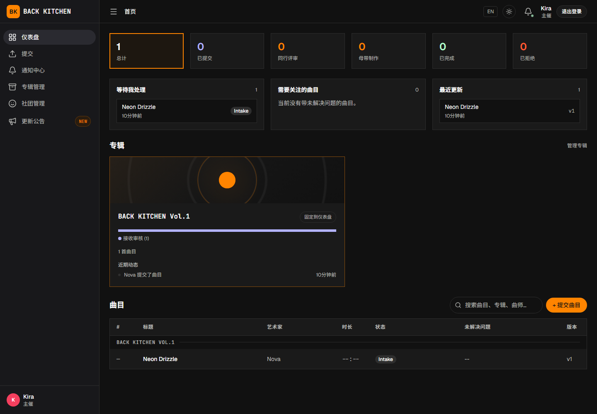
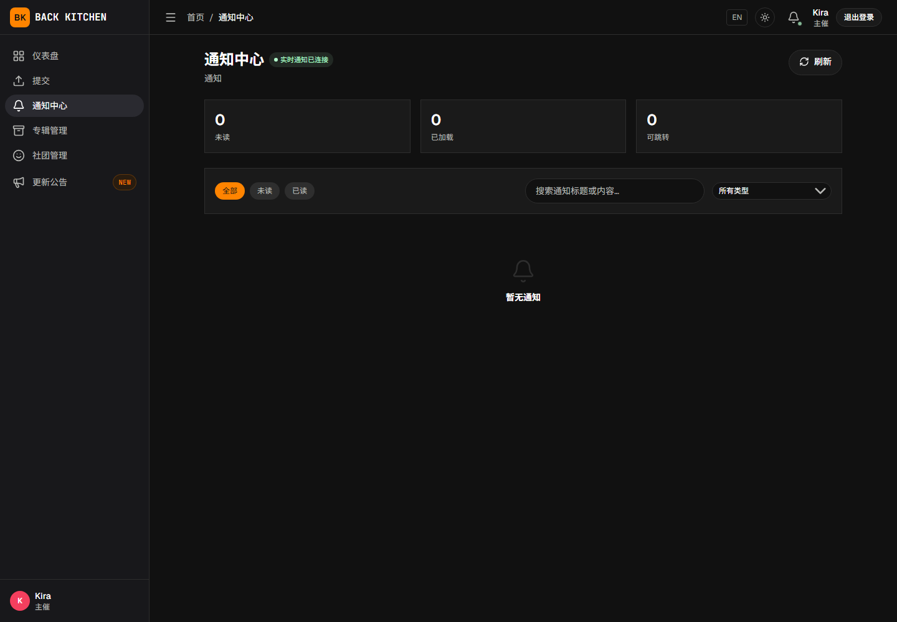
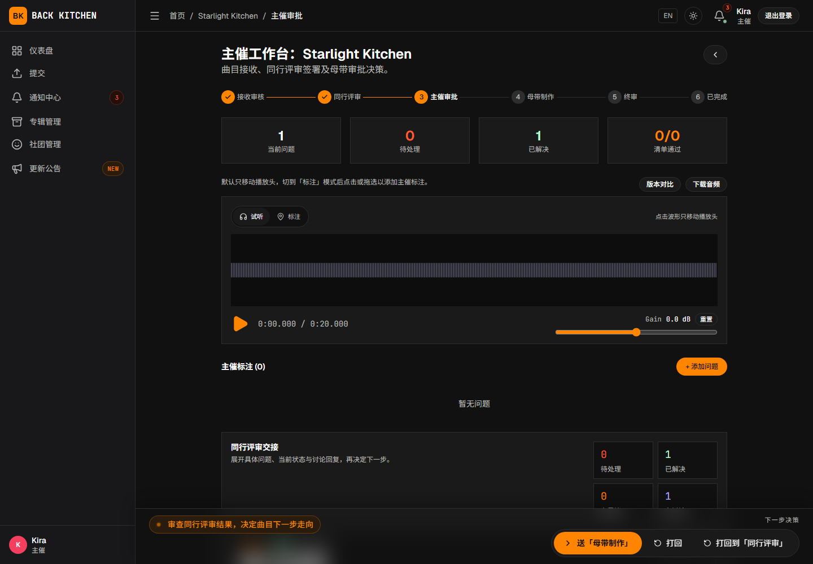

# 通知、待办事项与曲目状态

适用对象：所有用户

平台通过仪表盘、通知中心和曲目工作流进度提示当前需要处理的工作。

## 查看仪表盘

登录后首先进入仪表盘。根据当前身份和任务分配，仪表盘可能显示：

- 自己投稿的曲目；
- 被分配的同行评审；
- 等待主催处理的新投稿或审批；
- 等待母带工程师处理的曲目；
- 等待终审确认的母带；
- 最近更新的专辑和曲目。

点击对应曲目后，可进入曲目详情或当前工作流阶段。

## 使用通知中心

1. 打开侧栏中的“通知中心”。
2. 选择“全部”“未读”或“已读”。
3. 根据需要按通知类型筛选。
4. 可以在搜索框中搜索通知标题或正文。
5. 点击通知中的“打开”，进入相关曲目、问题或专辑。

通知中心只会在当前已加载的通知记录中执行“全部 / 未读 / 已读”、类型筛选和搜索。需要查找更早历史时，先点击“加载更多”，再重新筛选或搜索。

处理单条通知后，可以点击“标记已读”。需要清空未读提醒时，可以使用“全部已读”。

## 常见通知

平台可能在以下情况发送通知：

- 有新曲目提交；
- 曲目阶段发生变化；
- 需要主催手动分配评审人；
- 用户被分配或重新分配同行评审；
- 有新问题、评论或讨论；
- 用户在评论或讨论中被提及；
- 曲师需要上传修订版本；
- 母带交付物等待上传者确认；
- 终审退回、重新开启或源文件补交申请发生变化；
- 专辑或曲目被归档或恢复。

站内通知是主要提醒渠道，但并非每次阶段变化都会向下一负责人发送通知。不要只依赖通知判断任务，应同时检查仪表盘和曲目当前阶段。

部分专辑还可以配置邮件或 Webhook：

- 邮件只发送给已验证邮箱的平台曲师，并仅覆盖专辑启用的新公开问题、新评论和修订请求等选定事件；主催、评审人、母带工程师和纯外部曲师不会通过这套曲师邮件机制收信。
- Webhook 用于把专辑配置的事件推送到飞书等外部协作工具，其事件范围与邮件不同。

是否收到站外通知取决于专辑设置、事件类型和用户邮箱状态。

## 查看曲目当前状态

进入曲目后，使用工作流进度判断当前阶段。默认阶段包括：

| 状态 | 含义 | 通常由谁继续操作 |
|---|---|---|
| 接收审核 | 曲目已经提交，等待主催决定下一步 | 主催、副主催 |
| 同行评审 | 曲目正在接受同行检查 | 被分配的评审人 |
| 同行修订 | 评审要求修改源文件 | 投稿曲师 |
| 主催审批 | 主催检查评审和修订结果 | 主催、副主催 |
| 主催修订 | 主催要求再次修改源文件 | 投稿曲师 |
| 母带制作 | 等待母带沟通或交付 | 专辑母带工程师 |
| 母带修订 | 母带阶段要求修改源文件或提交分轨 | 投稿曲师 |
| 终审 | 等待主催和投稿曲师批准当前母带 | 主催与投稿曲师 |
| 已完成 | 双方已经批准当前母带 | 无必须操作 |
| 已拒绝 | 曲目被拒绝 | 视是否允许重新投稿而定 |

采用自定义工作流的专辑可能使用不同名称或顺序，应以页面显示为准。

## 判断自己是否需要操作

1. 检查通知是否指向当前用户。
2. 打开曲目并确认当前阶段。
3. 查看页面底部或操作区域是否显示可用按钮。
4. 阅读按钮上方的前置条件或等待提示。

没有操作按钮通常不表示系统出错。可能是当前阶段正在等待其他用户，或当前用户没有对应权限。

## 实时更新

通知中心会尝试通过实时连接接收更新，并定期重新获取通知。页面显示连接中断时，可以：

1. 检查网络连接；
2. 等待系统自动重连；
3. 重新打开通知页面；
4. 必要时刷新浏览器。

通知已经打开但仍显示未读时，可以手动点击“标记已读”。

## 常见问题

### 收到评审通知，但打不开曲目

评审任务可能已被重新分配，或专辑成员权限已经变化。返回通知中心刷新后仍无法访问时，请联系专辑主催。

### 曲目状态已经变化，但通知仍保留

通知记录不会在任务完成后自动删除。可将通知标记为已读，并以曲目页面的当前状态为准。

### 没有收到邮件通知

如果当前用户是平台曲师，请确认邮箱已经验证，并确认专辑启用了对应邮件事件。主催、评审人、母带工程师和外部曲师不会通过这套曲师邮件机制收信；请以站内通知、仪表盘或团队使用的 Webhook 为准。

## 相关说明

- [平台与完整制作流程](overview.md)
- [认识社团、专辑和曲目职责](roles.md)
- [问题、评论、附件与版本](issues-and-versions.md)
