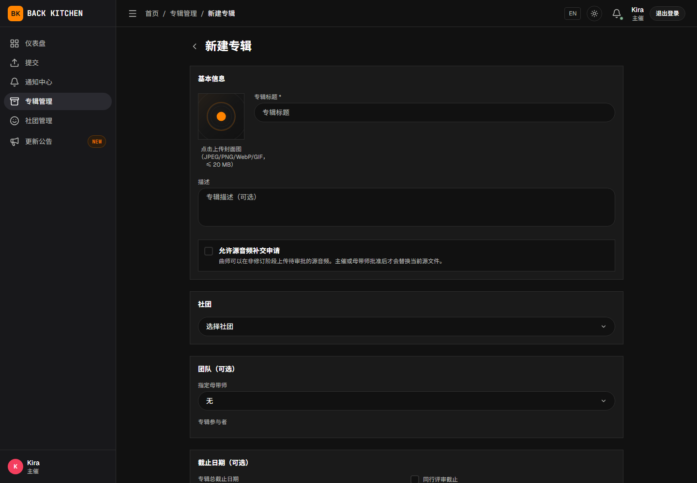
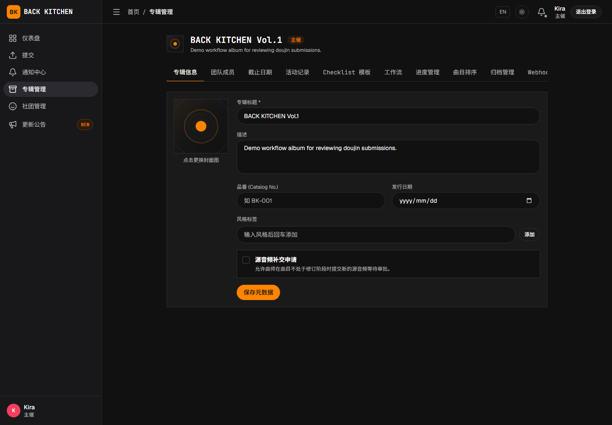

# 创建专辑并配置制作团队

适用对象：主催、副主催

专辑必须属于一个社团。创建时，专辑标题和所属社团为必填项；描述、封面、制作团队、截止日期和自定义工作流可以根据实际情况设置。未展开工作流编辑器时，平台会使用默认工作流。

## 操作前确认

- 已经创建社团，并邀请相关成员加入。
- 已经确定专辑主催、母带工程师和参与者。
- 已经确定投稿、同行评审、母带和终审的大致时间安排。
- 如果需要自动分配或固定评审，已经准备评审候选名单。

## 创建专辑

1. 打开“专辑管理”。
2. 点击“新建专辑”。
3. 填写必填的专辑标题，并根据需要填写描述。
4. 根据需要上传专辑封面。
5. 选择必填的所属社团。
6. 根据需要设置制作团队、截止日期和自定义工作流。
7. 点击“创建专辑”。

只能选择当前用户有权管理的社团。新建专辑必须选择所属社团。

## 配置制作团队

### 指定母带工程师

在制作团队中选择一位专辑母带工程师。可选用户必须已经加入专辑所属社团。

社团中的“母带工程师”身份不会自动完成专辑分配。应在每张专辑中明确选择实际负责人。

### 添加参与者

从社团成员中选择需要参与该专辑的用户。参与者通常包括：

- 计划投稿的曲师；
- 可能参加同行评审的成员；
- 需要查看专辑进度的制作人员。

将用户添加为专辑参与者，不会自动把该用户设为某首曲目的投稿曲师或评审人：

- 投稿曲师在提交曲目时通过平台用户 UID 绑定；
- 评审人由工作流规则或主催手动分配。

## 设置截止日期

可以设置：

- 专辑总截止日期；
- 同行评审截止日期；
- 母带截止日期；
- 终审截止日期。

截止日期用于向参与者说明计划安排，不会自动替代主催推进工作流。到期后仍应由当前负责人完成对应操作。

设置时应确保阶段日期按制作顺序排列，并为可能发生的修订留出时间。

## 设置默认审阅人分配方式

创建专辑时可以选择：

- 手动指派；
- 自动分配；
- 固定评审。

自动分配和固定评审还需要配置候选成员。仅保留默认“自动分配”但不选择“自动分配候选池”时，曲目进入同行评审后可能无法完成分配；应返回工作流设置补充候选池或调整人数后重试。

完整设置方法参见[设置同行评审规则](workflow.md)。

## 设置同行评审清单

1. 进入专辑设置。
2. 打开“Checklist 模板”。
3. 选择使用社团默认设置、为当前专辑启用或为当前专辑停用，并保存清单模式。
4. 启用后，添加或调整检查项目并保存模板。
5. 确认评审人了解每个项目的检查标准。

启用同行评审清单后，评审人必须先保存自己的当前清单，才能提交个人评审意见。清单用于统一检查内容，但不能替代问题描述；发现具体问题时，仍应在波形或问题面板中创建问题。

## 设置源音频补交

启用源音频补交后，投稿曲师可以在页面提供入口的非修订阶段提交新的源文件，不限于曲目完成后。

申请提交后，曲目立即进入源音频补交待处理状态，正常工作流暂时停止。当前审批卡只显示申请原因和返回阶段，不能直接试听或下载暂存的新文件；批准前应通过团队认可的安全方式核对文件内容、文件名和版本。

审批时需要选择批准后返回的阶段：

- 不能选择修订阶段，也不能选择首个交付阶段之后的阶段；
- 主催可以在符合上述条件的阶段中选择目标；
- 母带工程师只能批准返回母带相关阶段；
- 批准会建立新的制作周期，将补交文件设为当前源版本，并使旧的当前母带失效；
- 拒绝后，曲目恢复申请前的阶段；
- 投稿侧可以在审批前取消申请，取消后暂存文件会被删除，曲目恢复申请前的阶段。

该功能会替换当前源文件并重新启动制作流程，不只是用于归档文件。仅在团队确实需要阶段外补交时启用；普通制作修订应通过现有修订阶段完成。

## 配置工作流

未展开工作流编辑器时，新专辑会使用平台默认工作流。需要调整阶段、负责人或退回规则时：

1. 展开工作流编辑器。
2. 选择需要修改的阶段。
3. 调整“基础信息”“负责人和分配”“流转规则”或“修订回路”。
4. 检查流程画布和配置提示。
5. 保存专辑或工作流。

终审必须是最后一个主阶段，并且应保留发现问题后的退回路径。为保证最终批准操作可用，应保留系统预置的终审步骤；可以调整其显示名称和规则，但不要删除后再新建另一个终审步骤替代。

## 创建后检查

专辑创建成功后，建议立即检查：

1. 所属社团是否正确；
2. 母带工程师和参与者是否完整；
3. 截止日期是否正确；
4. 同行评审候选池和人数是否有效；
5. 工作流是否包含所需的修订和退回路径；
6. 曲师是否能够在投稿页面选择该专辑。

## 修改专辑设置

进入目标专辑后打开“专辑设置”，可以修改团队、截止日期、工作流和其他专辑配置。

修改工作流可能影响已经进入流程的曲目。页面提示存在阶段迁移时，应先确认影响范围，再保存设置。

## 归档和恢复

曲目可以在曲目页面归档，并在专辑设置的“归档管理”中恢复；专辑可以在专辑设置中归档，并从“专辑管理”的已归档列表恢复。

曲目和专辑归档后只有 **14 天**恢复期。超过期限后，归档对象及其关联的曲目、问题、评论、版本、母带和附件会被永久删除。归档前应先下载需要长期保存的文件，并确认没有尚未完成的制作任务。

## 常见问题

### 无法选择某位成员

请确认该用户已经加入专辑所属社团。其他社团的成员不能直接加入当前专辑团队。

### 创建后没有自动分配评审人

请检查是否已经设置“自动分配候选池”和“所需审阅人数”。已经进入同行评审的曲目，应在调整设置后返回曲目重新执行分配并检查结果。

### 母带工程师能看到社团，但看不到专辑母带任务

请进入专辑设置，确认其已经被选为该专辑的母带工程师，而不只是社团中的母带工程师成员。

## 相关说明

- [创建和管理社团](circles.md)
- [设置同行评审规则](workflow.md)
- [接收投稿与分配评审](intake.md)
