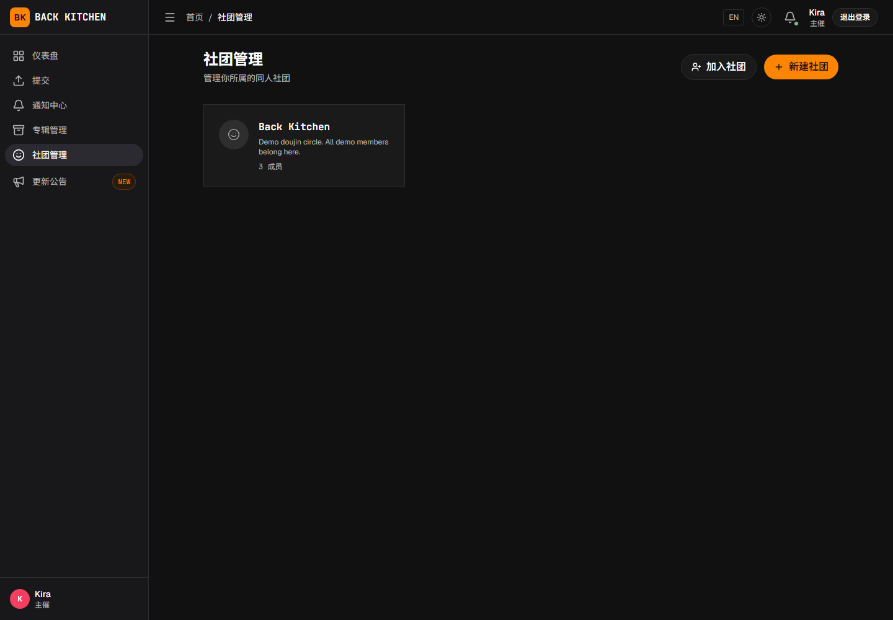
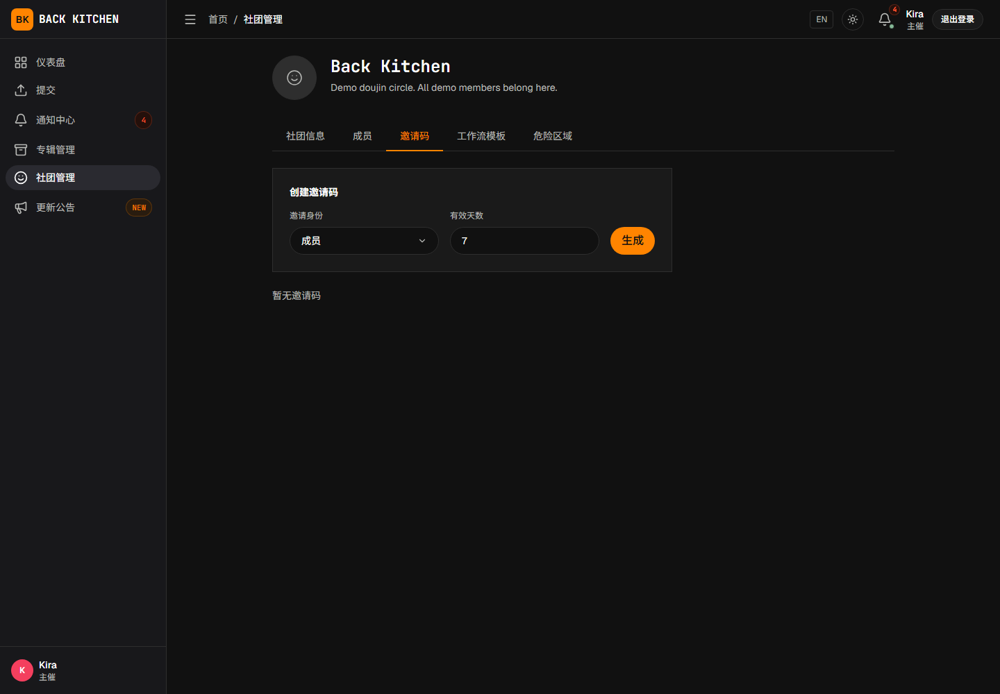

# 创建和管理社团

适用对象：主催、副主催

社团是专辑和制作成员的组织单位。创建专辑前，应先建立社团，并通过邀请码邀请曲师和母带工程师加入。

## 操作前确认

- 创建社团的账户已经由平台管理员开通主催权限。
- 已经准备必填的社团名称；说明可以稍后补充。
- 已经确定需要邀请的成员及其初始身份。

## 创建社团

1. 打开“社团管理”。
2. 点击“新建社团”。
3. 填写必填的社团名称，并根据需要填写说明。
4. 点击“创建社团”。

创建成功后，创建者自动成为该社团的主催，并可以管理成员、邀请码和社团内专辑。创建社团不会让用户管理其他社团或其他专辑。

## 通过邀请码邀请成员

1. 进入社团详情。
2. 打开“邀请码”。
3. 选择邀请码对应的初始身份：普通成员或母带工程师。
4. 设置有效期。
5. 生成邀请码。
6. 将邀请码发送给需要加入的用户。

邀请码只能用于加入指定社团。用户仍需先完成平台注册和邮箱验证。

## 使用邀请码加入社团

被邀请的用户需要：

1. 登录平台。
2. 打开“社团管理”。
3. 点击“加入社团”。
4. 输入邀请码。
5. 点击“加入”。

加入成功后，用户会出现在社团成员列表中。加入社团只表示用户属于该组织，可作为该社团专辑的团队候选；不会自动加入已有专辑，也不会获得任何曲目任务。

## 撤销邀请码

邀请码不再使用时，应及时撤销：

1. 进入社团详情的“邀请码”。
2. 找到仍处于启用状态的邀请码。
3. 点击撤销操作并确认。

已经过期、被撤销或失效的邀请码不能继续使用。撤销邀请码不会移除已经加入的成员。

## 查看和调整成员身份

在社团详情的成员列表中，可以查看每位成员的当前身份。

社团主催可以根据实际分工将成员调整为：

- 普通成员；
- 母带工程师；
- 副主催。

除平台运营/管理员协助处理外，只有社团主催可以调整成员身份。副主催可以协助管理社团和专辑，但不能代替社团主催修改成员身份。

## 设置副主催

需要其他成员协助管理时：

1. 确认该用户已经加入社团。
2. 在成员列表中找到该用户。
3. 将其身份调整为“副主催”。
4. 确认修改。

副主催可以管理所属社团中的专辑，并可以创建新专辑。副主催权限仅适用于当前社团，不会将其全局账户身份改为主催。

## 邀请母带工程师

使用“母带工程师”类型的邀请码，可以为成员添加社团层的母带身份。但这不会自动将其分配到所有专辑。

创建或编辑专辑时，还需要在专辑团队设置中明确选择该专辑的母带工程师；创建时可先留空，但进入母带交付阶段前必须补齐。

## 常见问题

### 看不到“新建社团”

当前账户可能尚未开通主催权限。请联系平台管理员，并在权限更新后重新登录。

### 提示邀请码无效

邀请码可能输入错误、已经过期或已被撤销。请联系社团主催获取新的邀请码。

### 成员加入社团后看不到专辑或曲目

加入社团不会自动加入已有专辑。请由专辑主催或有管理权限的社团主催/副主催将成员添加到专辑团队；曲目页面和操作还需要投稿曲师绑定、评审分配或母带工程师指定。

### 母带工程师加入后看不到母带任务

社团母带身份只表示组织层职责。请确认该用户已在目标专辑中被指定为“母带工程师”。

## 相关说明

- [创建专辑并配置制作团队](albums.md)
- [认识社团、专辑和曲目职责](../roles.md)
- [母带沟通、交付、修改与确认](../mastering.md)
