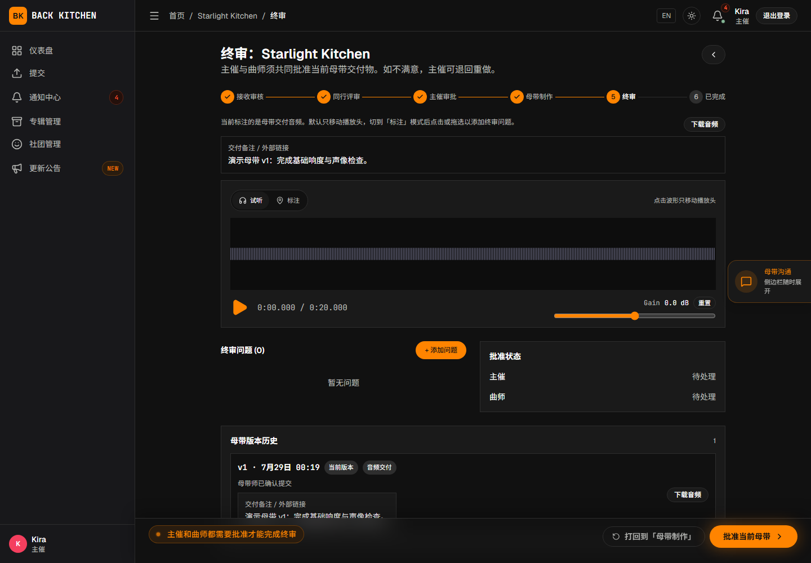
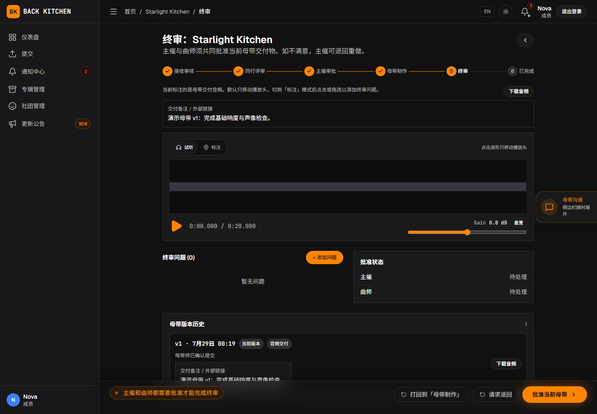

# 最终审核、完成与重新开启

适用对象：主催、副主催  
适用阶段：终审、已完成

母带交付物完成上传者确认后，曲目进入“终审”。默认流程要求主催和投稿曲师分别批准当前母带，双方都批准后曲目才会变为“已完成”。

## 操作前确认

- 当前母带已经由上传者确认无误。
- 正在审听最新的母带交付版本。
- 已经查看母带交付说明。
- 已经检查母带阶段的问题和沟通记录。
- 投稿曲师已经知道需要进行最终确认。

## 检查当前母带

1. 打开处于“终审”的曲目。
2. 查看当前母带的交付编号、上传者和确认时间。
3. 完整播放或下载母带文件。
4. 检查母带问题及其处理状态。
5. 必要时与历史母带版本进行比较。
6. 查看主催和投稿曲师的批准状态。

确认时应检查文件内容和交付信息，不应只根据文件名判断。终审问题的状态由专辑母带工程师处理；主催和投稿曲师可以补充评论，但不能代替母带工程师完成状态转换。

终审不是多人同行评审阶段，只支持公开问题，不会显示“仅内部”。旧页面或其他客户端尝试提交“仅内部”时，平台会拒绝请求且不会创建问题。

## 批准当前母带

确认母带可以作为最终版本后：

1. 点击“批准当前母带”。
2. 确认批准操作。
3. 查看主催批准状态是否已经更新。
4. 如果投稿曲师尚未批准，等待其完成确认。

主催批准不会单独完成曲目。只有主催和投稿侧都批准后，曲目才进入“已完成”。多人合作曲目只记录一次投稿侧批准，不要求每位绑定曲师分别确认；团队应先确定由哪位曲师代表投稿侧操作。

同一用户同时具有专辑管理权限和该曲目的投稿曲师身份时，一次批准可能同时完成双方确认。

## 打回到「母带制作」

发现母带问题时：

1. 创建问题或发表评论，记录具体退回原因。
2. 点击“打回到「母带制作」”。
3. 确认曲目返回“母带制作”。
4. 通知母带工程师查看问题并重新交付。

该操作没有单独填写原因的表单，应在点击前完成问题或评论记录。

新的母带交付完成后，曲目会再次进入终审。旧母带交付物仍保留在历史记录中。

## 投稿曲师退回母带

当前终审界面可能同时向投稿曲师显示“打回到「母带制作」”和“请求退回”：

- “打回到「母带制作」”是工作流直接退回操作；执行前应先创建终审问题或发表评论。
- “请求退回”当前不可用，不应依赖该操作推进流程。

发现问题时，投稿曲师应先创建问题或发表评论；页面允许直接打回时使用“打回到「母带制作」”，否则联系主催代为处理。

## 曲目完成后

双方批准后，曲目进入“已完成”。参与者仍可以：

- 播放或下载最终母带；
- 查看历史源版本和母带版本；
- 查看问题、评论和工作流记录；
- 在具有权限时申请或执行重新开启；
- 在专辑允许时申请补交源音频。

完成状态不会立即删除问题、评论和版本记录，但平台当前默认只继续保留非当前源版本的音频文件 7 天。需要长期保存时请及时下载；如果随后归档曲目，归档超过 14 天后整首曲目及其关联记录和文件会被永久删除。

## 重新开启曲目

确认已完成曲目需要再次进入制作流程时，专辑主催或专辑母带工程师可以执行重新开启：

1. 打开已完成曲目。
2. 选择重新开启操作。
3. 选择需要返回的工作流阶段。
4. 提交操作并检查新的当前阶段。

直接重新开启时无需填写申请理由。选择母带相关阶段后，页面会显示“母带备注（可选）”；需要留下其他说明时，应在操作前通过问题或评论记录。

重新开启后的结果取决于所选阶段：

- 返回首个交付阶段或更早阶段时，平台会建立新的制作周期；
- 返回晚于首个交付阶段的阶段时，不会增加制作周期；
- 当前母带的主催和投稿侧批准状态会被清除，需要重新终审；
- 新制作周期可能重置需要重新填写的同行评审清单；
- 历史版本、问题和工作流事件仍保留用于追踪。

当前界面允许母带工程师从可用的交付或修订阶段中选择返回目标，并未只限制为母带阶段。选择更早阶段前，应先与主催确认。重新开启会撤销当前完成结论，只应在确实需要继续正式制作时使用。

## 曲师的重新开启申请

投稿曲师可以对已完成曲目选择目标阶段、填写原因并提交重新开启申请。主催会收到通知。

当前普通主催页面不会显示申请原因和目标阶段，也没有“批准 / 拒绝”控件，无法按正常前端流程完成审批。收到通知后，应先与曲师确认申请内容，再联系平台管理员从管理后台处理。申请获批时会使用曲师提交时选择的目标阶段，审批人不能另选阶段。

不要另行使用主催的“直接重新开启”操作代替申请审批。直接重新开启不会将原申请标记为已处理，可能留下仍处于待处理状态的申请，并影响后续重新开启或源音频补交。

## 处理源音频补交申请

专辑启用源音频补交后，投稿曲师可以在页面提供入口的非修订阶段提交新的源文件，不限于已完成曲目。申请提交后，曲目立即进入源音频补交待处理状态，普通流程操作暂时停止。

当前审批卡只显示申请原因和可选返回阶段，不能直接试听或下载暂存的新文件。主催收到申请后应：

1. 阅读补交原因，并向投稿侧确认文件名和版本；
2. 通过团队认可的安全方式取得可核对的文件，完整试听或下载检查；
3. 判断新文件会影响哪些已经完成的评审或母带工作；
4. 批准时选择首个交付阶段或之前的非修订阶段，或拒绝申请；
5. 无法核对新文件时不要批准。

批准会建立新的制作周期，创建新的当前源版本，并使旧的当前母带失效。母带工程师也可以审批，但只能批准返回母带相关阶段。拒绝后，曲目恢复申请前的阶段；投稿侧也可以在审批前主动取消申请，取消后暂存文件会被删除。

源音频补交会替换当前源文件并重新启动制作流程，不应作为单纯的文件归档功能。

## 常见问题

### 主催已经批准，但曲目仍未完成

请检查投稿曲师是否也已经点击“批准当前母带”。默认流程需要双方确认。

### 看不到“打回到「母带制作」”

当前专辑的自定义工作流可能没有配置终审退回路径。请检查终审阶段的“额外打回目标”或修订设置。

### 已完成曲目为什么又出现在进行中

曲目可能已被重新开启，或正在处理源文件补交申请。打开工作流记录可以查看具体操作人和时间。

## 相关说明

- [母带沟通、交付、修改与确认](../mastering.md)
- [曲师：处理反馈、上传修订与确认母带](../composer/revision.md)
- [问题、评论、附件与版本](../issues-and-versions.md)
