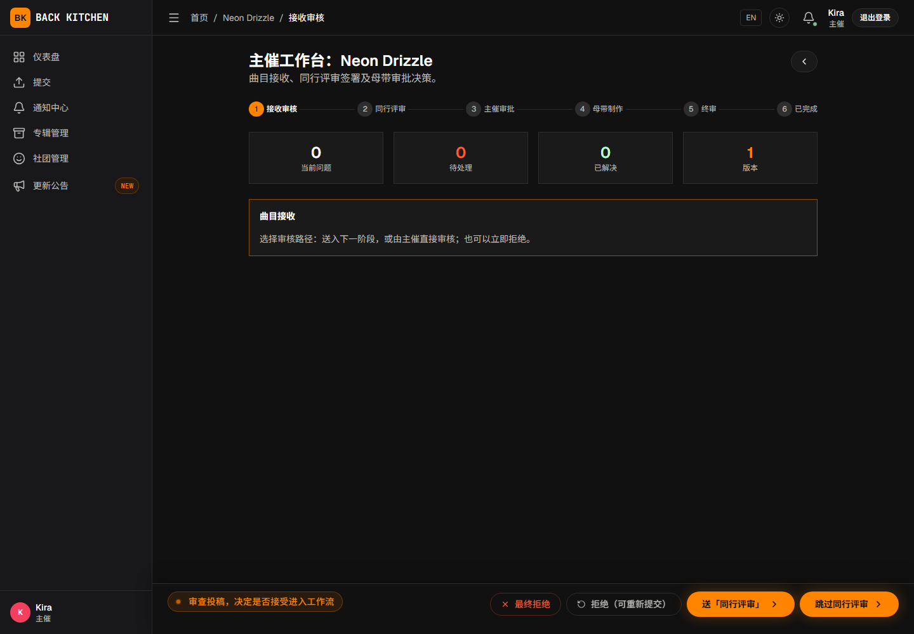

# 接收投稿与分配评审

适用对象：主催、副主催  
适用阶段：接收审核、同行评审

曲师提交新曲目后，曲目首先进入“接收审核”。主催需要检查投稿信息，并决定送「同行评审」、直接审核或拒绝。

## 操作前确认

- 投稿的专辑、曲目标题和艺术家信息正确。
- 音频文件能够正常播放或下载。
- 平台曲师 UID 与实际参与者一致。
- 专辑同行评审规则已经配置完成。

## 检查新投稿

1. 从仪表盘或通知中心打开新提交的曲目。
2. 查看曲目基本信息和提交说明。
3. 确认平台曲师及外部曲师信息。
4. 播放或下载当前源文件。
5. 查看曲目当前状态是否为“接收审核”。

发现信息或文件不完整时，不要直接推进流程。应先通过评论或团队沟通确认，或者使用允许重新提交的拒绝方式。

## 选择接收审核操作

### 送「同行评审」

点击“送「同行评审」”后，曲目进入“同行评审”阶段。系统会按照专辑工作流进行分配：

- 手动指派：等待主催选择评审人；
- 自动分配：从“自动分配候选池”中选择合格成员；
- 固定评审：分配符合条件的固定评审人。

### 跳过同行评审

点击“跳过同行评审”后，曲目跳过同行评审，直接进入“主催审批”。

该操作只在专辑工作流允许主催直接审核时显示。适合不需要同行评审，或已通过其他方式完成检查的曲目。

### 最终拒绝

点击“最终拒绝”后，曲目进入最终拒绝状态，不能通过普通重新投稿操作恢复。

只应在确定该曲目不再参与当前专辑时使用。执行前应确认曲师已经了解原因，并先下载需要保留的文件；不要依赖平台长期保留被拒绝曲目的音频。

### 拒绝（可重新提交）

点击“拒绝（可重新提交）”后，曲目进入可重新投稿的拒绝状态。投稿曲师可以上传新的源文件，开始新的制作周期。

适合以下情况：

- 初始文件错误或损坏；
- 曲目信息需要整体重填；
- 当前投稿不满足基本要求，但允许修改后重新进入流程。

## 手动分配评审人

使用“手动指派”时：

1. 将曲目送入“同行评审”。
2. 打开曲目的评审分配区域。
3. 从可用成员中选择评审人。
4. 确认分配。
5. 检查评审人是否已收到任务通知。

不能将曲目分配给该曲目的平台曲师。可选评审人通常来自专辑所属社团，并需要具有当前曲目的访问资格。

## 处理自动分配失败

曲目进入同行评审后没有评审人时，平台会通知主催进行处理。常见原因包括：

- 没有设置“自动分配候选池”；
- 候选池人数少于“所需审阅人数”；
- 候选成员都是该曲目的曲师；
- 固定评审人被曲师排除后无人可用；
- 成员已经离开社团或无法访问曲目。

处理方法：

1. 打开曲目并查看分配提示。
2. 如果工作流使用“手动指派”，在评审分配区域选择其他合格成员。
3. 如果使用“自动分配”或“固定评审”，返回专辑工作流设置，调整候选池、固定名单或所需人数并保存。
4. 返回曲目重新执行分配，并确认任务已经产生。

自动分配和固定评审模式当前不会在失败后打开临时成员选择器，不能直接绕过已保存的分配规则。调整工作流后，还应检查已经进入同行评审的其他曲目是否需要重新分配。

## 调整现有评审分配

评审人无法继续处理任务时，主催可以在曲目评审分配区域进行重新分配。手动指派模式允许选择具体成员；自动分配和固定评审会按照当前已保存的候选池或固定名单重新计算，不提供临时成员选择。重新分配后：

- 原评审人可能失去该任务的操作权限；
- 新评审人会收到分配通知；
- 已经创建的问题和评审记录仍会保留；
- 应向参与者说明交接原因，避免重复工作。

## 常见问题

### “跳过同行评审”按钮没有显示

当前专辑工作流可能没有启用“允许主催直接审核”。请在工作流编辑器的“接收审批”阶段检查设置；该配置阶段对应曲目页面上的“接收审核”。

### 找不到需要分配的成员

请确认用户已经加入专辑所属社团，并且不是该曲目的平台曲师。

### 送「同行评审」后曲目没有继续推进

曲目需要先获得有效评审分配，并由评审人完成规定人数的评审。请检查分配状态和“所需审阅人数”。

### 误用了最终拒绝

最终拒绝不能通过普通重新投稿恢复。请谨慎使用；如确需处理，应联系平台管理员确认是否存在其他恢复方式。

## 相关说明

- [设置同行评审规则](workflow.md)
- [主催审批、拒绝与重新投稿](approval.md)
- [曲师：进行同行评审](../composer/peer-review.md)
