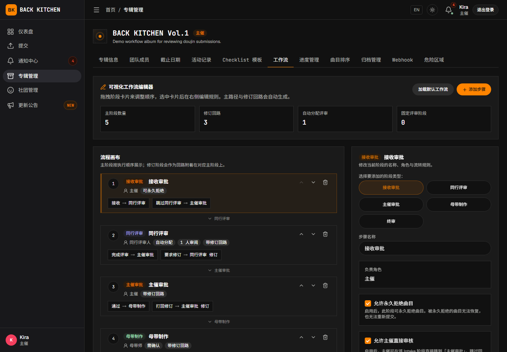

# 设置同行评审规则

适用对象：主催、副主催  
适用阶段：创建专辑时，或专辑开始接收投稿前

专辑可以采用手动指派、自动分配或固定评审。设置评审规则后，系统会在曲目进入“同行评审”阶段时按照该规则分配评审人。

> 本页介绍默认工作流。采用自定义工作流的专辑可能使用不同的阶段名称或评审设置。

## 操作前确认

开始设置前，请确认：

- 需要参与评审的用户已经加入专辑所属社团。
- 已经确定每首曲目至少需要几名评审人。
- 已经确定由主催逐首分配，还是由系统从“自动分配候选池”中分配。

曲师可以投稿自己的曲目，同时评审同一专辑中的其他曲目，但不能评审自己参与创作的曲目。系统分配评审人时会自动排除该曲目的平台曲师。

## 打开工作流设置

1. 进入需要配置的专辑。
2. 打开“专辑设置”。
3. 选择“工作流”。
4. 在工作流编辑器中找到“同行评审”阶段。
5. 设置“审阅人分配方式”“自动分配候选池”或“固定评审人”，并确认“所需审阅人数”。

创建专辑时，也可以在“新建专辑”页面中展开工作流设置并完成相同配置。

## 选择评审分配方式

### 手动指派

选择“手动指派”后，曲目进入“同行评审”阶段时不会自动获得评审人。主催需要打开该曲目并选择实际评审人。

适合以下情况：

- 每首曲目需要由不同的专业人员评审。
- 评审安排需要根据曲风、分工或成员时间决定。
- 专辑规模较小，主催希望逐首确认。

如果主催尚未完成指派，曲目会停留在等待评审分配的状态。

### 自动分配

选择“自动分配”后，系统会从“自动分配候选池”中选择当前待处理任务较少的合格成员。

使用自动分配时，必须同时完成以下设置：

1. 选择“自动分配候选池”。
2. 设置“所需审阅人数”。
3. 确认候选池中有足够的成员可供分配。

系统不会将曲目分配给该曲目的平台曲师。如果排除曲师后没有足够的合格成员，分配会失败；主催需要调整候选池或所需审阅人数，保存后再重新分配。

> 仅选择“自动分配”而没有设置“自动分配候选池”，并不能完成自动分配。正式接收投稿前，请保存包含候选池的完整工作流设置。

### 固定评审

选择“固定评审”后，主催需要在“固定评审人”中预先指定一组成员。曲目进入“同行评审”阶段时，系统会将符合条件的固定成员分配给该曲目，并要求实际分配到的评审人全部完成评审。

固定名单中的成员如果也是某首曲目的平台曲师，会在该曲目的评审中被自动排除。如果排除后无人可以评审，主催需要扩大固定名单、调整所需人数，或将分配方式改为手动指派后再重新分配。

固定评审适合以下情况：

- 所有曲目由同一组人员统一检查。
- 专辑设有固定的音频、编曲或制作审核人员。
- 需要保持不同曲目之间的评审标准一致。

## 设置评审人范围

“自动分配候选池”和“固定评审人”使用专辑所属社团的成员作为候选来源。成员是否被添加为专辑参与者，不会直接决定其是否成为评审人。

选择成员时，应确认：

- 成员已经加入专辑所属社团。
- 成员具有查看和处理分配任务所需的有效账户。
- 成员人数能够覆盖曲师排除和成员暂时无法参与等情况。

保存前应人工确认候选成员能够正常登录并参与当前项目；候选账户不可用时，可能导致分配人数不足。

如果成员尚未加入社团，请先通过社团邀请码邀请其加入，再返回工作流设置。

## 设置所需审阅人数

“所需审阅人数”表示一首曲目需要完成多少份有效评审，才能继续提交评审结论。

设置时应同时考虑：

- 候选成员总数；
- 每首曲目可能包含的曲师人数；
- 曲师不能评审自己的曲目；
- 是否需要不同专业方向的多名评审人。

所需人数高于实际可分配人数时，曲目无法按预期完成分配。自动分配或固定评审模式应调整候选池、固定名单或所需人数后重新分配；如需指定具体成员，应先将分配方式改为“手动指派”并保存。

## 设置返修触发方式

启用同行评审的修订回路后，可以在“返修触发方式”中选择：

- **达到人数后统一决定**：评审人先分别提交个人意见；达到所需审阅人数后，再由评审组提交最终结论。
- **任一评审打回即返修**：评审人可以使用直接返修操作，让曲目立即进入修订阶段。

两种方式下，评审人都可以先提交建议打回。只有执行对应的最终结论或直接返修操作，曲目才会进入修订阶段。

## 保存设置

1. 检查“同行评审”阶段的分配方式。
2. 检查“自动分配候选池”或“固定评审人”，并确认所需审阅人数。
3. 点击“保存工作流”。
4. 确认页面没有显示未保存的修改或配置错误。

保存后，新进入“同行评审”阶段的曲目会按照当前设置分配评审人。已经进入评审阶段的曲目可能仍需主催检查现有分配。

## 异常情况

### 曲目进入同行评审后没有评审人

可能原因包括：

- 使用了“手动指派”，但主催尚未选择评审人；
- 使用了“自动分配”，但没有设置“自动分配候选池”；
- 候选成员都是该曲目的曲师；
- 排除不符合条件的成员后，剩余人数不足。

请打开曲目查看分配提示。手动指派模式可以直接选择评审人；自动分配或固定评审模式应先返回工作流设置，调整“自动分配候选池”“固定评审人”或所需审阅人数，保存后再重新分配。

### 无法选择某位评审成员

请确认该用户已经加入专辑所属社团。仅注册平台账户或被添加为其他社团的成员，不会使其成为当前专辑的评审候选人。

### 固定评审名单中没有可用评审人

固定名单中的成员如果参与了该曲目的创作，会被自动排除。排除后无人可以评审时，请扩大固定评审人名单、调整所需人数，或先把分配方式改为手动指派并保存，再返回曲目重新分配。

### 修改设置后，进行中的曲目没有立即变化

工作流设置主要决定曲目进入相关阶段时的分配方式。对于已经进入同行评审的曲目，请同时检查该曲目的现有评审分配，并根据页面提示进行调整。

## 相关说明

- [创建专辑并配置制作团队](albums.md)
- [接收投稿与分配评审](intake.md)
- [曲师：进行同行评审](../composer/peer-review.md)
- [认识社团、专辑和曲目职责](../roles.md)
