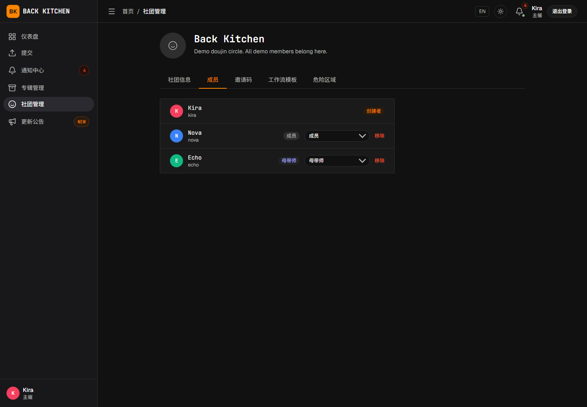

# 认识社团、专辑和曲目职责

适用对象：所有用户

Back Kitchen 的权限分为账户、社团、专辑和曲目四个层级。同一用户在不同层级可以承担不同职责。

## 账户身份

| 身份 | 取得方式 | 主要权限 |
|---|---|---|
| 普通成员 | 公开注册后自动获得 | 加入社团、参与专辑、投稿或接受评审任务 |
| 主催 | 注册后由平台管理员开通 | 创建社团；在已加入且具备创建资格的社团中创建专辑 |

账户主催身份不会自动授予其他社团或专辑的管理权限。只有创建的社团、自己负责的专辑，或已加入且被赋予管理职责的社团/专辑，才会进入相应管理范围。

## 社团身份

| 身份 | 主要权限 |
|---|---|
| 主催 | 社团创建者；管理社团、成员、邀请码和社团内专辑 |
| 副主催 | 协助管理所属社团及其专辑 |
| 普通成员 | 参与投稿、同行评审或其他制作工作 |
| 母带工程师（界面简称“母带师”） | 表示用户可以作为社团的母带人员候选 |

除平台运营/管理员协助处理外，只有社团主催可以调整成员身份和设置副主催。成员通过不同类型的邀请码加入后，主催仍可在社团成员设置中调整其身份。

## 专辑职责

一张专辑具有自己的制作团队：

- **专辑主催**：创建或主要负责该专辑的用户。
- **副主催**：所属社团的副主催，可以协助管理专辑。
- **专辑母带工程师**：在专辑设置中被明确指定的母带负责人。
- **专辑参与者**：被添加到专辑团队中的社团成员。

社团成员只有被添加到专辑团队或具备该专辑管理职责后，才会看到对应专辑页面；被添加到专辑团队也不等同于被分配曲目任务。曲目级访问仍取决于投稿曲师绑定、评审分配或母带工程师指定。

社团中的“母带工程师”身份不会自动将用户分配到所有专辑。专辑创建时可以暂不指定母带工程师，但进入母带交付阶段前必须在专辑设置中明确指定，用户才能执行该专辑的母带操作。

## 投稿曲师

用户成为某首曲目的投稿曲师，需要在投稿表单的艺术家信息中通过平台用户 UID 进行绑定。

投稿曲师可以：

- 查看自己的曲目；
- 阅读公开问题和评论；
- 处理问题状态；
- 上传源文件修订版本；
- 在终审中批准当前母带；
- 在允许的情况下重新投稿或申请重新开启。

一首曲目可以绑定多名平台曲师，也可以包含外部曲师姓名。任意一名绑定的平台曲师都可以执行投稿侧修订等操作；终审只记录一次投稿侧批准，因此多人合作时应先约定由谁代表操作。

## 外部曲师与代投稿

没有平台账户的曲师可以作为外部曲师记录在曲目中。纯外部曲师的曲目需要由专辑主催或副主催代为投稿。

实际代投稿人负责执行需要投稿侧完成的操作，例如：

- 上传初始源文件；
- 回复和处理问题；
- 上传修订版本；
- 代表投稿侧确认最终母带。

外部曲师本人不会收到平台内任务或通知。

## 同行评审人

用户只有在被分配到某首曲目的同行评审阶段后，才是该曲目的评审人。

评审人可以：

- 审听被分配的曲目；
- 创建时间点、时间范围或整体问题；
- 填写同行评审清单；
- 提交个人评审意见；
- 在具有权限时提交评审组最终结论。

同一用户可以投稿自己的曲目，同时评审同一专辑中的其他曲目，但不能评审自己参与创作的曲目。系统进行自动分配或固定评审分配时，会排除该曲目的平台曲师。

## 身份显示与匿名评审

在同行评审及其修订阶段，平台可能使用匿名编号隐藏曲师或评审人的真实身份。具体显示取决于当前工作流、查看者职责和页面区域：

- 普通评审人通常看不到曲师的真实身份；
- 曲师通常看不到其他评审人的真实身份；
- 问题列表中的作者即使对作者本人、主催或母带工程师也可能继续显示匿名编号；
- 主催或母带工程师可能在团队、评审分配等其他区域看到相应真实身份；
- 自定义工作流中的匿名显示可能与默认同行评审阶段不同。

匿名显示只改变界面中的身份呈现，不影响任务分配、问题记录和通知，也不应被视为严格的保密或权限边界。处理敏感信息时，仍应遵守团队的信息共享规则。

## 为什么看不到某个操作

常见原因包括：

- 当前曲目阶段不由该身份操作；
- 用户尚未加入所属社团；
- 用户尚未被添加到目标专辑团队，或没有该专辑管理职责；
- 用户没有被指定为专辑母带工程师；
- 用户没有被绑定为该曲目的平台曲师；
- 用户尚未收到同行评审分配；

请先检查曲目当前阶段、专辑团队和自己的任务分配。

## 相关说明

- [平台与完整制作流程](overview.md)
- [主催：创建专辑并配置制作团队](producer/albums.md)
- [曲师：提交自己的曲目](composer/submission.md)
- [母带工程师指南](mastering.md)
